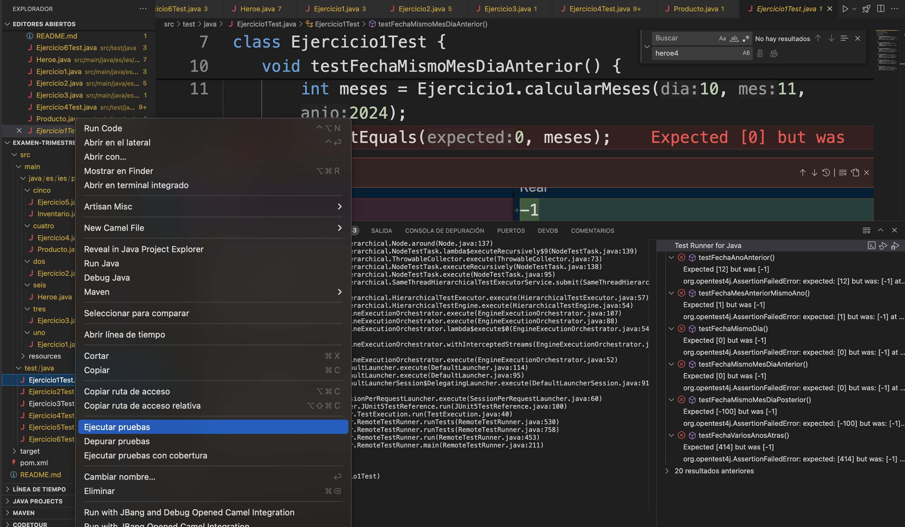
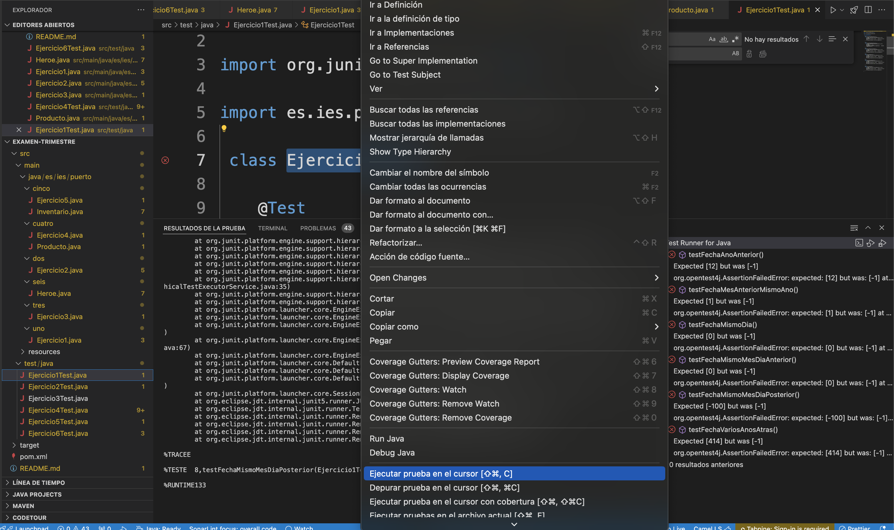
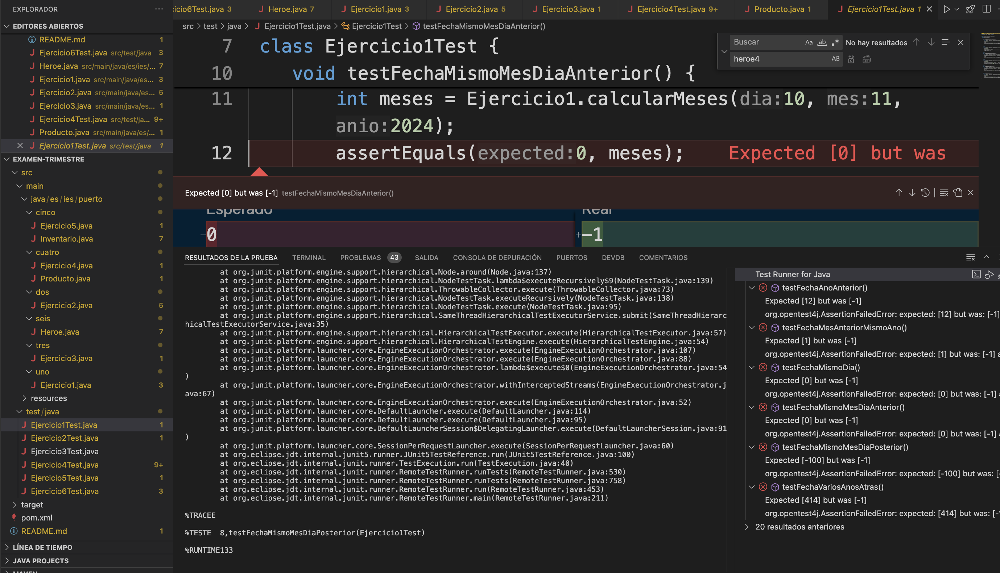
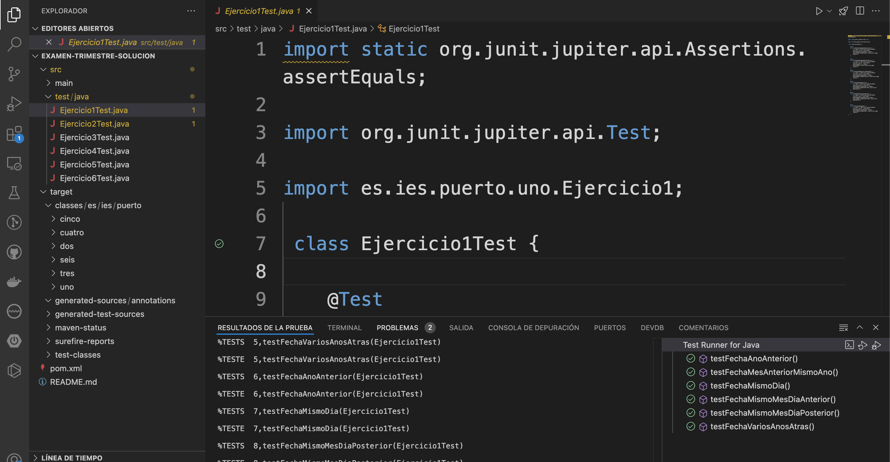

# Examen programación I trimestre

## Ejercicio 0: compila el proyecto

Abre en primer lugar una terminal y ejecuta:

```code
mvn clean test
```

## Ejercicio1: Paga mensual

Crea un programa que calcule la paga mensual una persona desde una fecha dada (`dia`,`mes`, `anio`), hasta la fecha actual.

Para ello realiza en el ejercio `Ejercicio1` las funciones `calcularMeses` y `paga`, donde esta última calcula el número de meses * 100€.

> *Importante*: Documenta la clase y sus métodos.

## Ejercicio2:  La Forja de la Vocal Suprema

`Version Friki`:En un reino lejano, existe una antigua leyenda sobre el poder oculto de las vocales, una fuerza capaz de transformar cualquier palabra en una expresión poderosa. En esta misión, tu tarea es liberar el poder de una vocal y elevarla a su forma suprema.

`Otra explicación`:Escribir un programa que dada una `frase` y una `vocal`, y devuelva `la misma frase pero con la vocal introducida en mayúscula`.

> *Implementa el método* ***String convertirFrase(String frase)*** *, y has uso de ella en el método main con la pruebas que consideres oportunas*

> *Importante*: Documenta la clase y sus métodos.

## Ejercicio3: Loteria navidad

Escribir un programa que dado los números de lotería de navidad almacenados en un `array`, los muestre por pantalla ordenados de menor a mayor.

>> *Implementa el método* ***ordenarArray(int[])***

> *Importante*: Documenta la clase y sus métodos.

## Ejercicio4: Manipulando productos

Imagina que trabajas en una aplicación de gestión de inventario y necesitas crear la base de datos para almacenar productos de una tienda. Como primer paso, debes crear la clase Producto, que será el modelo de cada uno de los artículos en el sistema. La clase debe tener las propiedades y métodos necesarios para representar y manipular cada producto.

- Define los siguientes atributos privados:
  - `int id`: identificador único de cada producto.
  - `String nombre`: nombre del producto.
  - `float precio`: precio del producto.
  - `int stock`: cantidad disponible del producto en inventario.
  
- Definición de métodos:
  - `actualizarStock`: Añade un método llamado `actualizarStock(int cantidad)` que actualice el inventario de un producto sumando o restando el valor de cantidad. `El método restará cuando el resultado sea < 0`.

> *Importante*: Documenta la clase y sus métodos, así como completa la clase con todo lo que consideres necesario.


## Ejercicio5: Inventario

En este ejercicio, demostrarás tus habilidades de programación implementando un sistema de gestión de inventario de productos. Utilizarás la clase llamada `Producto` para representar los productos de una tienda, y una clase `Inventario` que permitirá realizar operaciones `CRUD` `(Crear, Leer, Actualizar, Eliminar)` sobre los productos.

- Implementa los simientos métodos en la clase Inventario:
  - *crear(Producto producto)*: Añade un nuevo producto a la lista.
  - *mostrar()*: Devuelve la lista completa de productos. **Crea el método de la clase**.
  - *actualizar(Producto producto)*: Actualiza los datos de un producto existente.
  - *eliminar()*: Elimina el último producto de la lista.
  - *buscarProducto(Producto producto)*: Busca y devuelve si existe. Si no existe, devuelve false.

> *Importante*: Documenta la clase y sus métodos, así como completa la clase con todo lo que consideres necesario.

## Ejercicio6: Corrige la clase Heroe

Corrige la clase Heroe en aquellos conceptos que consideres que debería tener toda clase.

> *Importante*: Documenta la clase y sus métodos, así como completa la clase con todo lo que consideres necesario.


## Ejecución de prubas de cada uno de los ejercicios.

Si quieres ayudarte con las pruebas implementadas, en el proyecto, recuerda que ***debes de observar el resultado en la parte baja derecha del ide***. Debes de lanzar las pruebas de una de las siguientes formas

### 1. Una forma de lanzar las pruebas



### 2. Otra forma de lanzar las pruebas




### Resultados durante el comienzo al lanzar las pruebas



### Resultados con el ejercicio correcto

